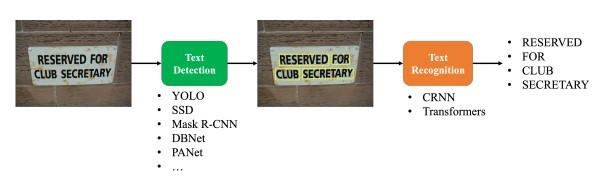
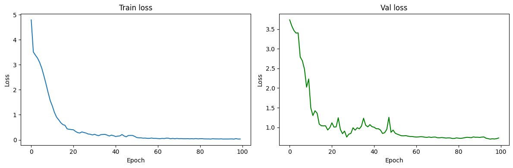

# 🌟 Scene Text Detection and Recognition 🌟

This project implements a **scene text detection and recognition system** using 🚀 **YOLOv11** for text detection and a custom-built 📝 **CRNN (Convolutional Recurrent Neural Network)** for text recognition. The system is trained and evaluated on the 📊 **ICDAR2003 dataset**.

---

## 📖 Project Overview

🎯 **Goal**: Detect and recognize text in natural scene images with a two-step pipeline:  
1. **Text Detection** 🖼️: YOLOv11 localizes text regions by predicting bounding boxes.  
2. **Text Recognition** ✍️: A custom CRNN model transcribes the text within those regions.  

The system tackles challenges in the ICDAR2003 dataset like varying fonts, orientations, and lighting conditions! 💡

### 🔄 Workflow Illustration
Here’s how the pipeline flows:  


---

## 📂 Dataset
The project uses the **ICDAR2003 dataset** 📈, which includes natural scene images with annotated text regions and transcriptions. It’s split into:  
- 🟢 **Training**  
- 🟡 **Validation**  
- 🔴 **Test**  

---

## 🛠️ Model Details

### 🔲 Text Detection (YOLOv11)
- **Model**: YOLOv11, a cutting-edge object detection model 🕵️‍♂️  
- **Training**: Fine-tuned on ICDAR2003 to detect text bounding boxes.  
- **Output**: Bounding box coordinates for text regions 📍  

### 📜 Text Recognition (CRNN)
- **Model**: Custom-built CRNN with convolutional and recurrent layers 🔗  
- **Training**: Trained on cropped text regions from ICDAR2003.  
- **Output**: Transcribed text from detected regions 📝  

---

## 📈 Training and Validation Results (CRNN)

  

---

## 🌟 Inference Results

  

---

## ⚙️ Setup and Usage
Follow these steps to get started:  

1. **Prepare the Dataset** 📦:  
   - Download the ICDAR2003 dataset.  
   - Preprocess it using `preprocessing.py`.  
   - Organize into: `data/icdar2003/train`, `data/icdar2003/val`, `data/icdar2003/test`.  

2. **Build Dataset & Vocabulary for CRNN** 🗂️:  
   - Run: `recognition/build_dataset.py` to prepare the recognition dataset.  
   - Run: `recognition/build_vocab.py` to create the vocabulary.  

3. **Train the Models** 🏋️‍♂️:  
   - For YOLOv11: Use `detection/train_detection.py`.  
   - For CRNN: Use `recognition/train_recognition.py`.  

4. **Inference** 🔍:  
   - **Text Detection**: Detect text regions in an image:  
     ```bash
     python detection/inference_detection.py --im_path <path_to_input_image>
     ```  
   - **Text Recognition**: Recognize text in cropped regions:  
     ```bash
     python recognition/inference_recognition.py --im_path <path_to_cropped_image>
     ```

---

## 🗂️ Directory Structure
```
project_root/
├── detection/ 🕵️‍♂️
│   ├── inference_detection.py
│   └── train_detection.py
├── recognition/ 📝
│   ├── build_dataset.py
│   ├── build_vocab.py
│   ├── inference_recognition.py
│   ├── network.py
│   └── train_recognition.py
├── preprocessing.py ⚙️
└── README.md 📜
```

---

## 💡 Notes
- Ensure ICDAR2003 is preprocessed with `preprocessing.py` before training.  
- CRNN expects cropped text regions from YOLOv11 detections.  
- Tune hyperparameters in training scripts for best performance! 🔧  

---

✨ **Happy coding!** ✨